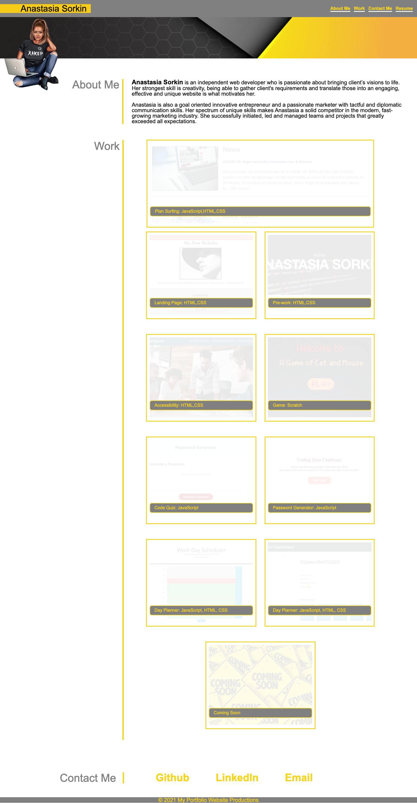
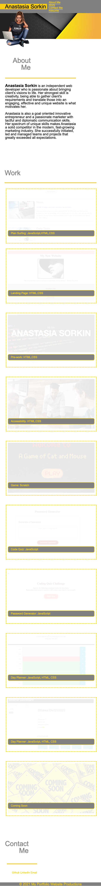
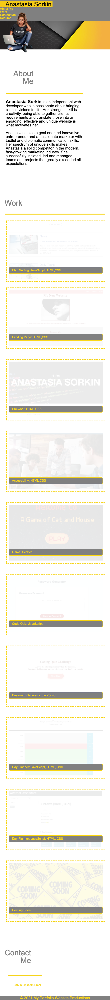

# homework-02-Portfolio

## Table of contents

* General info
* Specifics
* Screenshot
* Deployment of application
* Next steps

## General Info
This Website was built in order to show to potentional employer ability to build website itself from scratch as well as provide with previous work experience and contact info.

## Specifics

* Font used in this project is Arial, since it is one of the most available and the most accessible font;
* Color theme picked based on personal preferences and accessibility;
* Arrangements of the content based on provided example, meeting all specific criteria listed in homework;
* Work section was re-done several times using different ways to built work portfolio to meet better visual and functional criteria. Multiple ways contained: Grid boxes in HTML, Background images in CSS, Grid with flex. Based on multiple attempts flexbox appears to be the most responsive and visually satisfying;
* All elements responded in a good way while resizing the screen. Following changes were done when the screen becomes smaller: 
    * borders change from left to top;
    * h2 sizes and margins adjusted;
    * nav in header decrease weight and change position from inline to column;
    * nav in contact area decrese size to stay in line;
    * flexbox flex to columns and the border changes to dashed
    * header and footer are flex warp in order to stay where we want it.

## Screenshot

* Desktop 
 

* Mobile
  

 

## Deployment of application
To run a project, please follow the link [https://sheymanidze.github.io/Professional-Portfolio/](https://sheymanidze.github.io/Professional-Portfolio/)

## Next steps

* Websites will be constantly updated with new and most valuable work experienece; 
* Possible layout adjustment.