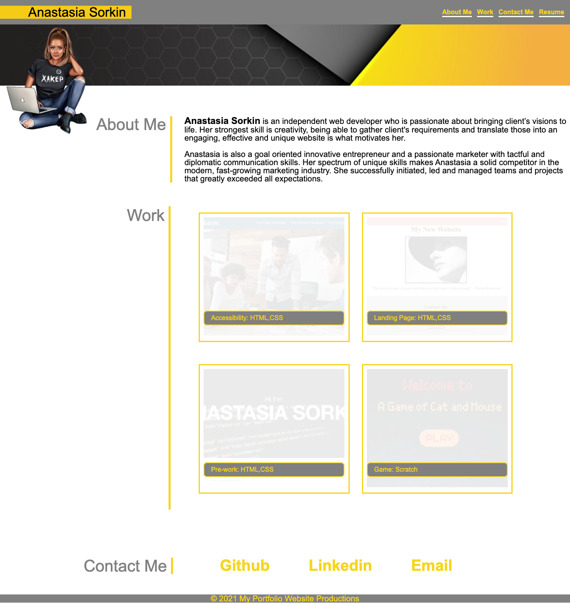
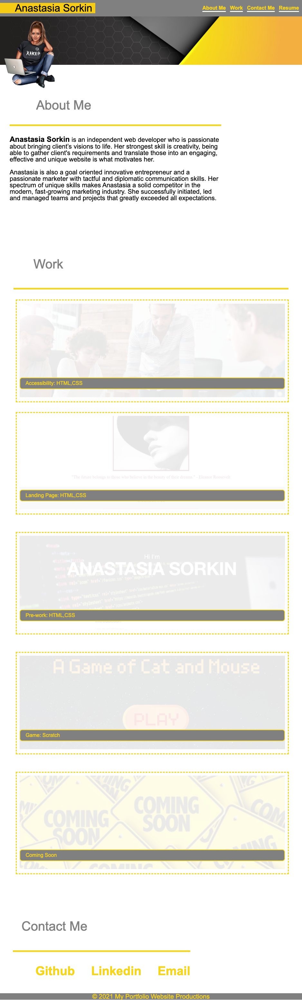
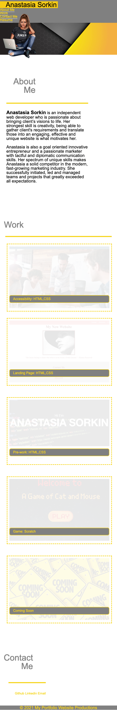

# homework-02-Portfolio

## Table of contents

* General info
* Specifics
* Screenshot
* Deployment of application

## General Info

## Specifics

Font used in this project is Arial, since it is one of the most available and the most accessible font.

## Screenshot

* Full Page

* Smaller size pages

## Deployment of application
To run a project, please follow the link [https://sheymanidze.github.io/Professional-Portfolio/](https://sheymanidze.github.io/Professional-Portfolio/)